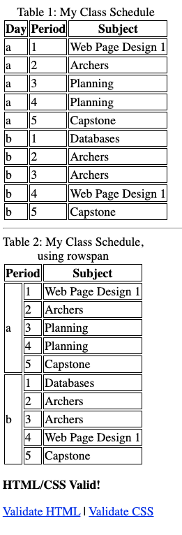

## Lesson Objectives
By the end of this lesson, you should:

- **Know**: 🍱 The parts of an HTML table
- **Understand**: 🚣‍♀️ The role of rowspan and columnspan attributes
- **Be Able To**: 🧑‍💻 Construct your own HTML table

## What We'll Do In Class

### No Quiz
I forgot to write a reading assignment last time, so there's no quiz today. 

Last class you worked on writing a technical page in HTML. I'll grade that this afternoon, and it will be your first grade of Q2.
    

### Tables
Today, we'll work on tables in HTML. I'll start with a short demo, and then I'll give you some challenges to work on.

### vim resources
This will be the most intricate document we've written in vim so far, and you'll likely want to do some copy/pasting. [Here's a nice guide that should help you out](https://www.warp.dev/terminus/vim-copy-paste), and I always recommend periodically reviewing vimtutor to pick up new tips and tricks.

### Table Practice
Make a new HTML page that shows your class schedule. Here is an example of what it should look like:

Note: your goal is to produce "Table 2" below, but I recommend starting with "Table 1" and then modifying it.

## Homework

### Read the next few pages in Module 2
On our [edube.org](https://edube.org/) class, tables are the last topic in Module 2. Review that page, and then start reading Module 3. So read through these three pages:

- Tables
- Images

There are a lot of little details and attributes to know for tables and images, so be sure to go through these slowly and carefully. Be prepared for a reading quiz next class - everything on these two pages is fair game!