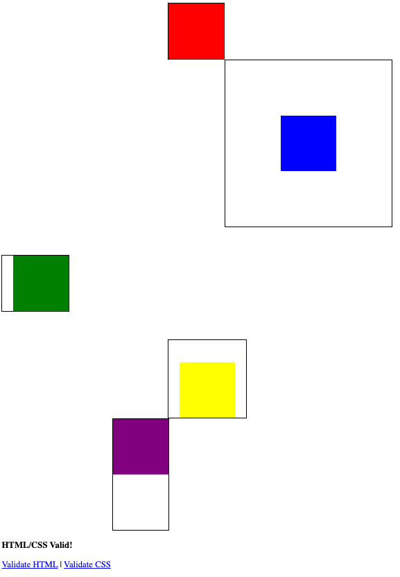

## Lesson Objectives
By the end of this lesson, you should:
- **Know**: How the CSS cascade rules work.
- **Understand**: How to use different units for sizing elements.
- **Be Able To**: Apply CSS styles to elements and fonts using percentage, px, em, and vw units.

## What We'll Do In Class

### Reading Quiz
We'll start with a reading quiz. This quiz includes the most content from the
last two reading assignments: CSS cascade rules, and the box model.

### The Box Model
I'll give a quick overview of the box model.

### Div Exploration
I'll let you play with the box model on your own.

I want you to make a page with five different divs. Give each div an id,
and use an internal stylesheet (in the `head` tag) to style each div.

From there, try to recreate this image:

A few hints:
- The content of each box is 100px/100px
- Each box has `background-clip:content-box;`
- Each box has `border:2px solid;`

Commit this when you're done!

## Homework
If you didn't already, finish up your box model challenge. Do the best you can!

### Reading
Next class, we'll do a little detour about fonts (or should I say typefaces?).

Instead of our usual reading, i'd like you to [watch this 30-minute documentary](https://www.youtube.com/watch?v=WVfRxFwVHQc). Don't worry about memorizing all of the fonts that are presented in this video, just focus on the themes. We won't have a reading quiz about fonts, but we'll spend plenty of time playing with them next class.

