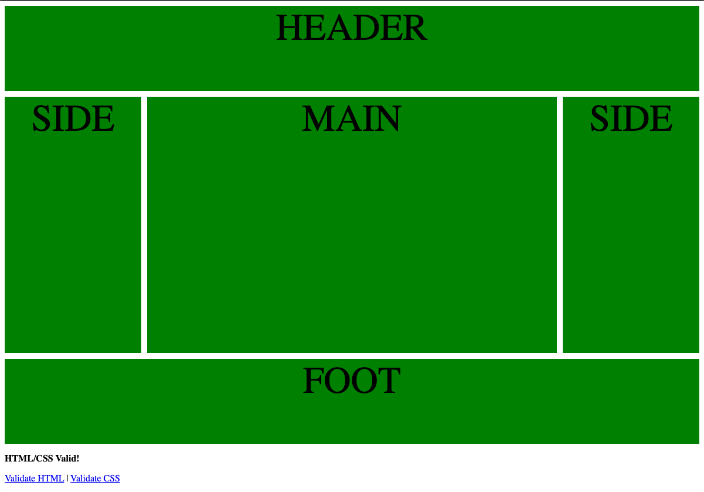
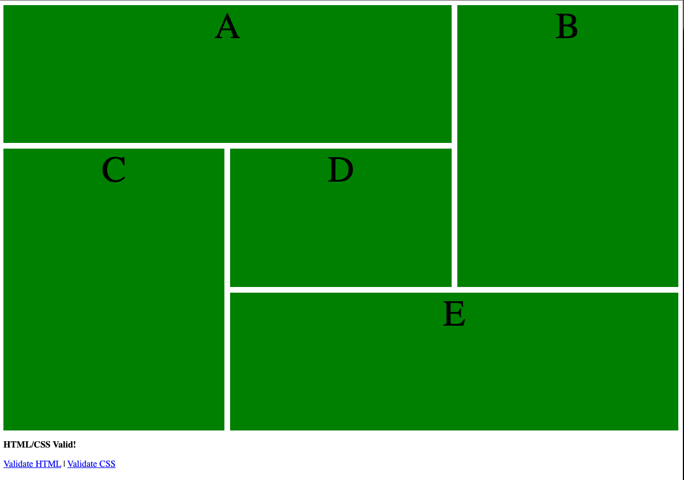

## Lesson Objectives
By the end of this lesson, you should:
- **Know**: How the CSS cascade rules work.
- **Understand**: How to use different units for sizing elements.
- **Be Able To**: Apply CSS styles to elements and fonts using percentage, px, em, and vw units.

## What We'll Do In Class

### Reading Quiz
We'll start with a reading quiz. See last session for more information about 
the reading assignment.

### Practice with CSS Grid
To practice with CSS Grid, we'll play with [https://cssgridgarden.com/](https://cssgridgarden.com/) 

### Div Exploration
Once we're comfortable with 

From there, create a directory in your website folder called "grid_practice" and add files recreating these two images:

Commit this when you're done - it'll count as a classwork grade!

## Homework
If you didn't already, finish up your grid model challenge. Do the best you can!

### Reading
No reading quiz next class because I assume folks will be taking off early for the holiday.

Next class, I'll introduce a project that will be due January 10 (one week after we return from break). If you're out next class and want to work on the project over break, be sure to check the website for the assignment!

